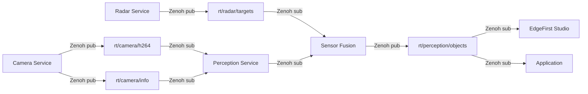
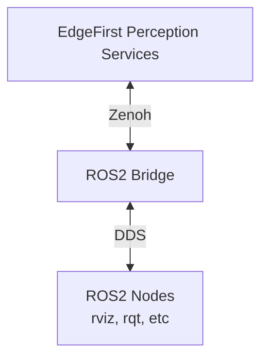
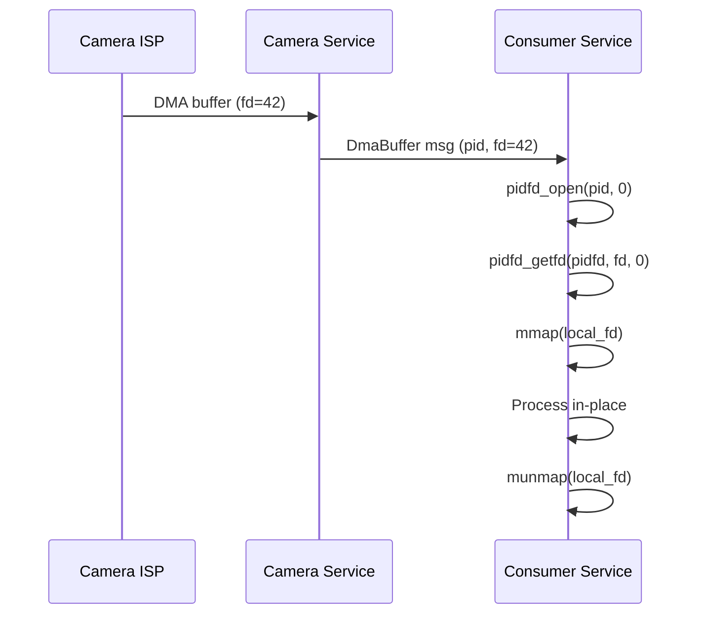

# EdgeFirst Perception Schemas - Architecture

**Version:** 1.0
**Last Updated:** November 17, 2025
**Target Audience:** Developers implementing or integrating EdgeFirst Perception

---

## Table of Contents

- [Overview](#overview)
- [Design Principles](#design-principles)
- [Core Components](#core-components)
- [Message Serialization](#message-serialization)
- [Language Bindings](#language-bindings)
- [Zenoh Communication](#zenoh-communication)
- [ROS2 Interoperability](#ros2-interoperability)
- [Zero-Copy DMA Buffers](#zero-copy-dma-buffers)
- [Source Code Reference](#source-code-reference)

---

## Overview

EdgeFirst Perception Schemas is a **schema library** providing message type definitions and high-performance language bindings for the EdgeFirst Perception middleware. It serves as the communication contract between EdgeFirst Perception services.

### Key Characteristics

- **Schema-first design**: Message definitions drive code generation
- **Multi-language support**: Rust (native) and Python bindings
- **Standards-based**: ROS2 CDR serialization, ROS2 message compatibility
- **Transport-agnostic**: Works over Zenoh, can bridge to ROS2 DDS
- **Zero-copy capable**: DMA buffer sharing on embedded platforms

### Scope

This is **NOT** a middleware framework - it provides:
- ✅ Message type definitions (.msg files, IDL)
- ✅ Serialization/deserialization (CDR encoding)
- ✅ Language-specific bindings (Rust structs, Python dataclasses)

This is **NOT** included:
- ❌ Transport layer (provided by Zenoh)
- ❌ Service discovery (provided by Zenoh)
- ❌ Message routing (provided by Zenoh)

---

## Design Principles

### 1. ROS2 Compatibility Without ROS2 Dependency

**Goal**: Enable ROS2 message interchange without requiring ROS2 installation.

**Implementation**:
- Use standard ROS2 message definitions
- Implement CDR (Common Data Representation) serialization
- Compatible with ROS2 Humble Hawksbill LTS
- Can bridge to ROS2 via Zenoh ROS2 DDS plugin when needed

**Benefits**:
- Works on Windows, macOS, Linux
- No ROS2 installation required for most users
- Smaller deployment footprint
- Easier cross-platform development

### 2. Performance-First

**Goal**: Minimize serialization overhead for real-time perception systems.

**Techniques**:
- Zero-copy where possible (DMA buffers)
- Efficient CDR binary encoding
- Compile-time type checking (Rust)
- Minimal allocations during hot paths

### 3. Hardware Integration

**Goal**: Enable efficient data flow from hardware accelerators (NPU, ISP, DSP).

**Approach**:
- DMA buffer file descriptor sharing
- Hardware-specific metadata (radar, camera)
- Platform-agnostic abstractions

---

## Core Components

### Message Schema Hierarchy

```
EdgeFirst Perception Schemas
├── ROS2 Common Interfaces (standard)
│   ├── std_msgs (Header, String, primitives)
│   ├── geometry_msgs (Pose, Transform, Twist, etc.)
│   ├── sensor_msgs (PointCloud2, Image, CameraInfo, Imu, etc.)
│   ├── nav_msgs (Odometry, Path)
│   └── builtin_interfaces (Time, Duration)
│
├── Foxglove Schemas (visualization)
│   ├── SceneUpdate (3D visualization)
│   ├── ImageAnnotations
│   └── Grid, Pose markers
│
└── EdgeFirst Custom Messages (edge AI)
    ├── Detect (object detection results)
    ├── Box (2D bounding box)
    ├── Track (object tracking)
    ├── DmaBuffer (zero-copy hardware buffers)
    ├── RadarCube (raw radar FFT data)
    ├── RadarInfo (radar configuration)
    ├── Model (inference metadata)
    └── ModelInfo (performance instrumentation)
```

### Language Binding Structure

**Rust** (`src/`):
```
src/
├── lib.rs              # Public API, re-exports
├── std_msgs.rs         # ROS2 standard messages
├── geometry_msgs.rs    # ROS2 geometry
├── sensor_msgs.rs      # ROS2 sensors + PointCloud2 decode
├── nav_msgs.rs         # ROS2 navigation
├── builtin_interfaces.rs  # ROS2 time types
├── rosgraph_msgs.rs    # ROS2 graph (Clock)
├── foxglove_msgs.rs    # Foxglove visualization
├── edgefirst_msgs.rs   # EdgeFirst custom messages
└── service.rs          # ROS2 service wrapper
```

**Python** (`edgefirst/schemas/`):
```
edgefirst/schemas/
├── __init__.py              # Public API, decode_pcd utility
├── std_msgs.py
├── geometry_msgs.py
├── sensor_msgs.py
├── nav_msgs.py
├── builtin_interfaces.py
├── foxglove_msgs.py
└── edgefirst_msgs.py
```

**Message Definitions** (`edgefirst_msgs/msg/`):
```
edgefirst_msgs/msg/
├── Box.msg
├── Detect.msg
├── Track.msg
├── DmaBuffer.msg
├── RadarCube.msg
├── RadarInfo.msg
├── Model.msg
├── ModelInfo.msg
├── Mask.msg
├── Date.msg
└── LocalTime.msg
```

---

## Message Serialization

### CDR (Common Data Representation)

EdgeFirst uses **CDR** for binary serialization, the same format as ROS2 DDS.

#### CDR Encoding Rules

- **Primitives**: Little-endian by default
- **Alignment**: Natural alignment (4-byte for int32, 8-byte for float64)
- **Strings**: Length-prefixed UTF-8
- **Arrays**: Length-prefixed elements
- **Structs**: Sequential field encoding

**Example (Rust):**

```rust
use serde::{Serialize, Deserialize};

#[derive(Serialize, Deserialize)]
pub struct Header {
    pub stamp: Time,      // 8 bytes (sec) + 4 bytes (nanosec)
    pub frame_id: String, // 4 bytes (length) + UTF-8 data
}
```

#### Why CDR?

- ✅ **ROS2 compatible**: Same encoding as ROS2 DDS
- ✅ **Well-specified**: OMG standard
- ✅ **Efficient**: Compact binary representation
- ✅ **Language-agnostic**: Works across Rust, Python, C++
- ✅ **Tooling**: Existing libraries (cdr, pycdr2)

### Serialization Libraries

**Rust**:
- `serde` + `serde_derive`: Serialization framework
- Marshalling handled by Zenoh transport

**Python**:
- `pycdr2`: CDR encoding/decoding
- `dataclasses`: Python 3.7+ for message types

---

## Language Bindings

### Rust Implementation

**Key Features**:
- Zero-copy deserialization where possible
- Type-safe at compile time
- serde-based serialization

**Example (PointCloud2):**

```rust
// src/sensor_msgs.rs
#[derive(Serialize, Deserialize, PartialEq, Clone, Debug)]
pub struct PointCloud2 {
    pub header: std_msgs::Header,
    pub height: u32,
    pub width: u32,
    pub fields: Vec<PointField>,
    pub is_bigendian: bool,
    pub point_step: u32,
    pub row_step: u32,
    pub data: Vec<u8>,       // Raw point data
    pub is_dense: bool,
}
```

**PointCloud Decoding** (`src/lib.rs:decode_points`):

Optimized decoder that:
1. Parses field layout from PointField definitions
2. Builds struct format string for parsing
3. Uses zero-copy indexing into data buffer
4. Returns HashMap of field_name → value

### Python Implementation

**Key Features**:
- `pycdr2.IdlStruct` base class for CDR compatibility
- Type hints for IDE support
- Named tuples for decoded point clouds

**Example (PointCloud2 decode):**

```python
# edgefirst/schemas/__init__.py
def decode_pcd(pcd: PointCloud2) -> list[NamedTuple]:
    """Decodes PointCloud2 to list of named tuples."""
    # Parse field layout
    fields.sort(key=lambda f: f.offset)

    # Build struct format for decoding
    struct_format = endian_format + field_types...

    # Decode points
    Point_ = namedtuple("Point_", field_names)
    for i in range(pcd.height * pcd.width):
        p = Point_._make(struct.unpack_from(struct_format, data, offset))
        points.append(p)

    return points
```

**Accessing decoded points:**

```python
points = decode_pcd(point_cloud_msg)
for point in points:
    x, y, z = point.x, point.y, point.z
    rgb = point.rgb  # If RGB field exists
```

---

## Zenoh Communication

### Zenoh Integration

Zenoh is the primary transport for EdgeFirst Perception.

**Why Zenoh?**
- ✅ **Cross-platform**: Linux, Windows, macOS, embedded
- ✅ **High performance**: Sub-microsecond latency
- ✅ **Flexible**: Pub/sub, query, storage
- ✅ **ROS2 bridge**: Interoperates with ROS2 when needed
- ✅ **Discovery**: Automatic peer discovery
- ✅ **Routing**: Multi-hop, edge-to-cloud

### Topic Naming Convention

EdgeFirst Perception uses hierarchical topic naming with the `rt/` prefix (runtime topics):

```
rt/service/data_type
```

**Actual EdgeFirst Perception Topics:**

**Camera:**
- `rt/camera/h264` - H.264 compressed camera frames
- `rt/camera/dma` - Zero-copy DMA buffer frames
- `rt/camera/info` - Camera metadata (resolution, calibration)
- `rt/camera/jpeg` - JPEG compressed frames

**Radar:**
- `rt/radar/cube` - Raw radar FFT cube data
- `rt/radar/targets` - Detected radar targets
- `rt/radar/clusters` - Clustered radar detections
- `rt/radar/info` - Radar configuration metadata

**Sensors:**
- `rt/imu` - Inertial measurement unit data
- `rt/gps` - GPS location data

**Transforms:**
- `rt/tf_static` - Static coordinate frame transforms

### Message Flow Example

Real-world EdgeFirst Perception pipeline showing camera and radar data flow:



### Code Example (Rust + Zenoh)

```rust
use edgefirst_schemas::sensor_msgs::CompressedImage;
use zenoh::prelude::*;

// Publisher
let session = zenoh::open(config).await?;
let publisher = session.declare_publisher("rt/camera/h264").await?;

let img = CompressedImage { /* ... */ };
let encoded = cdr::serialize(&img)?;
publisher.put(encoded).await?;

// Subscriber
let subscriber = session.declare_subscriber("rt/camera/h264").await?;
while let Ok(sample) = subscriber.recv_async().await {
    let img: CompressedImage = cdr::deserialize(&sample.payload)?;
    process_image(img);
}
```

---

## ROS2 Interoperability

### Zenoh ROS2 DDS Bridge

EdgeFirst Perception does NOT require ROS2, but can interoperate when needed via the [Zenoh ROS2 DDS Bridge](https://github.com/eclipse-zenoh/zenoh-plugin-ros2dds).

**Architecture:**



**Use Cases:**
- Visualize EdgeFirst data in RViz
- Record MCAP files with ROS2 tools
- Integrate with existing ROS2 systems
- Use ROS2 diagnostic tools

**Setup:**

```bash
# Install Zenoh ROS2 bridge
# Configure bridge to map EdgeFirst topics to ROS2
zenoh-bridge-ros2dds -c bridge_config.json
```

**Important**: ROS2 DDS has different security characteristics than Zenoh. Use SROS2 (Secure ROS2) in production.

---

## Zero-Copy DMA Buffers

### DmaBuffer Message

The `DmaBuffer` message enables zero-copy sharing of hardware buffers (camera ISP, NPU outputs).

**Message Definition** (`edgefirst_msgs/msg/DmaBuffer.msg`):

```
std_msgs/Header header
int32 pid                 # Process ID of camera service
int32 fd                  # DMA buffer file descriptor
uint32 width              # Image width in pixels
uint32 height             # Image height in pixels
string encoding           # Pixel encoding (e.g., "rgb8", "nv12")
uint32 size               # Buffer size in bytes
```

### How It Works



### Acquiring the File Descriptor

The camera service publishes its process ID (`pid`) and the buffer's file descriptor (`fd`) in the `DmaBuffer` message. Consumer applications must acquire a local copy of the file descriptor using Linux system calls.

**Process:**

1. **Get Process FD**: Call `pidfd_open(pid, 0)` to obtain a file descriptor referencing the camera service process
2. **Duplicate FD**: Call `pidfd_getfd(pidfd, fd, 0)` to create a local duplicate of the camera buffer's file descriptor

**Consumer Side Implementation:**

```rust
use nix::sys::mman::{mmap, munmap, ProtFlags, MapFlags};
use std::os::unix::io::RawFd;

// Acquire local file descriptor from camera service
// Note: Requires pidfd_open and pidfd_getfd system calls (Linux 5.6+)
let pidfd = unsafe { libc::syscall(libc::SYS_pidfd_open, dma_buffer.pid, 0) as RawFd };
if pidfd < 0 {
    return Err(std::io::Error::last_os_error());
}

let local_fd = unsafe {
    libc::syscall(libc::SYS_pidfd_getfd, pidfd, dma_buffer.fd, 0) as RawFd
};
if local_fd < 0 {
    return Err(std::io::Error::last_os_error());
}

// Map DMA buffer into process memory
let ptr = unsafe {
    mmap(
        None,
        dma_buffer.size as usize,
        ProtFlags::PROT_READ,
        MapFlags::MAP_SHARED,
        local_fd,
        0,
    )?
};

// Process data (zero-copy!)
let data = unsafe {
    std::slice::from_raw_parts(
        ptr as *const u8,
        dma_buffer.size as usize
    )
};

// Cleanup
unsafe {
    munmap(ptr, dma_buffer.size as usize)?;
    libc::close(local_fd);
    libc::close(pidfd);
}
```

**Permission Requirements:**

The consumer application will not be able to call `pidfd_getfd` if it runs at a lower permission level than the camera service. Running as `sudo` or as a system service resolves this.

**Reference:** See the [EdgeFirst Camera Documentation](https://doc.edgefirst.ai/latest/perception/topics/camera/#cameradma) for complete examples.

### Security Considerations

- Validate file descriptors before use
- Implement access control (SELinux, AppArmor)
- Don't expose DMA buffers to untrusted processes
- Clear sensitive data after use

---

## Source Code Reference

| Component | Location | Purpose |
|-----------|----------|---------|
| **PointCloud2 decode** | `src/lib.rs:45` | Efficient point cloud decoding |
| **DmaBuffer** | `src/edgefirst_msgs.rs:10` | Zero-copy buffer sharing |
| **Detect message** | `src/edgefirst_msgs.rs:150` | Object detection results |
| **CDR serialization** | Via `serde` derives | Automatic via macro |
| **Python decode_pcd** | `edgefirst/schemas/__init__.py:16` | Python point cloud decode |
| **Message definitions** | `edgefirst_msgs/msg/*.msg` | Source IDL definitions |

---

## Additional Resources

- **[EdgeFirst Perception Documentation](https://doc.edgefirst.ai/latest/perception/)**: Complete developer guides
- **[EdgeFirst Samples](https://github.com/EdgeFirstAI/samples)**: Example applications
- **[Zenoh Documentation](https://zenoh.io/docs/)**: Zenoh pub/sub details
- **[ROS2 Message Spec](https://docs.ros.org/en/humble/Concepts/About-ROS-Interfaces.html)**: ROS2 message format
- **[CDR Specification](https://www.omg.org/spec/DDSI-RTPS/)**: OMG CDR standard

---

**For questions or clarifications:** support@au-zone.com
