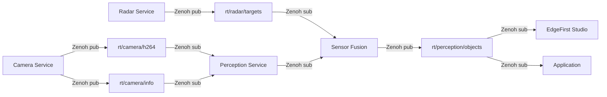
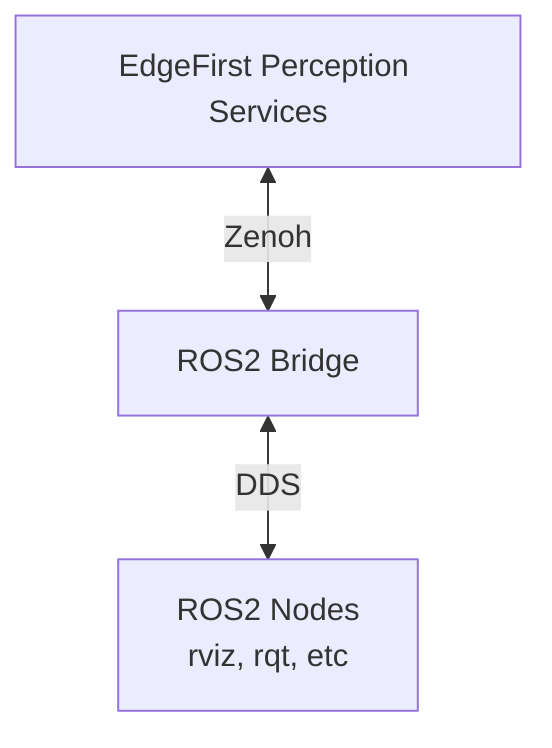
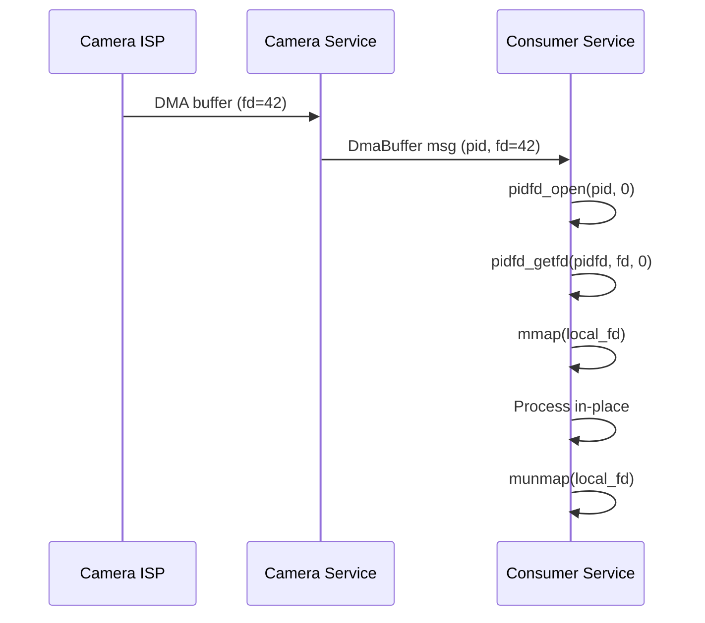

# EdgeFirst Perception Schemas - Architecture

**Version:** 3.1.0
**Last Updated:** April 2026
**Target Audience:** Developers implementing or integrating EdgeFirst Perception

---

## Table of Contents

- [Overview](#overview)
- [Design Principles](#design-principles)
- [Core Components](#core-components)
- [Message Serialization](#message-serialization)
- [Language Bindings](#language-bindings)
- [PointCloud Access Layer](#pointcloud-access-layer)
- [Zenoh Communication](#zenoh-communication)
- [ROS2 Interoperability](#ros2-interoperability)
- [Zero-Copy DMA Buffers](#zero-copy-dma-buffers)
- [Source Code Reference](#source-code-reference)

---

## Overview

EdgeFirst Perception Schemas is a **schema library** providing message type definitions and high-performance language bindings for the EdgeFirst Perception middleware. It serves as the communication contract between EdgeFirst Perception services.

### Key Characteristics

- **Schema-first design**: Message definitions drive code generation
- **Multi-language support**: Rust (native) and Python bindings
- **Standards-based**: ROS2 CDR serialization, ROS2 message compatibility
- **Transport-agnostic**: Works over Zenoh, can bridge to ROS2 DDS
- **Zero-copy capable**: DMA buffer sharing on embedded platforms

### Scope

This is **NOT** a middleware framework - it provides:
- ✅ Message type definitions (.msg files, IDL)
- ✅ Serialization/deserialization (CDR encoding)
- ✅ Language-specific bindings (Rust structs, Python dataclasses)

This is **NOT** included:
- ❌ Transport layer (provided by Zenoh)
- ❌ Service discovery (provided by Zenoh)
- ❌ Message routing (provided by Zenoh)

---

## Design Principles

### 1. ROS2 Compatibility Without ROS2 Dependency

**Goal**: Enable ROS2 message interchange without requiring ROS2 installation.

**Implementation**:
- Use standard ROS2 message definitions
- Implement CDR (Common Data Representation) serialization
- Compatible with ROS2 Humble Hawksbill LTS
- Can bridge to ROS2 via Zenoh ROS2 DDS plugin when needed

**Benefits**:
- Works on Windows, macOS, Linux
- No ROS2 installation required for most users
- Smaller deployment footprint
- Easier cross-platform development

### 2. Performance-First — Zero-Copy CDR

**Goal**: Minimize serialization overhead for real-time perception systems.

**Techniques**:
- **Serialization is a no-op**: Messages are constructed directly in-place within a buffer. The buffer *is* the serialized form.
- **Deserialization builds offset tables**: Receiving a CDR buffer constructs an offset table mapping variable-length fields to their positions. No data is copied.
- **Field access reads directly from the buffer**: Fixed-size fields use computed offsets; variable-length fields use the offset table.
- Zero-copy DMA buffer sharing on embedded platforms
- Compile-time type checking (Rust)
- Minimal allocations during hot paths

### 3. Hardware Integration

**Goal**: Enable efficient data flow from hardware accelerators (NPU, ISP, DSP).

**Approach**:
- DMA buffer file descriptor sharing
- Hardware-specific metadata (radar, camera)
- Platform-agnostic abstractions

---

## Core Components

### Message Schema Hierarchy

```
EdgeFirst Perception Schemas
├── ROS2 Common Interfaces (standard)
│   ├── std_msgs (Header, String, primitives)
│   ├── geometry_msgs (Pose, Transform, Twist, etc.)
│   ├── sensor_msgs (PointCloud2, Image, CameraInfo, Imu, etc.)
│   ├── nav_msgs (Odometry, Path)
│   └── builtin_interfaces (Time, Duration)
│
├── Foxglove Schemas (visualization)
│   ├── SceneUpdate (3D visualization)
│   ├── ImageAnnotations
│   └── Grid, Pose markers
│
└── EdgeFirst Custom Messages (edge AI)
    ├── Detect (object detection results)
    ├── Box (2D bounding box)
    ├── Track (object tracking)
    ├── CameraFrame / CameraPlane (zero-copy multi-plane video)
    ├── DmaBuffer (deprecated — use CameraFrame)
    ├── RadarCube (raw radar FFT data)
    ├── RadarInfo (radar configuration)
    ├── Model (inference metadata)
    └── ModelInfo (performance instrumentation)
```

### Language Binding Structure

**Rust** (`src/`):
```
src/
├── lib.rs                  # Public API, re-exports
├── cdr.rs                  # Zero-copy CDR1-LE: CdrCursor, CdrWriter, CdrSizer, CdrFixed
├── std_msgs.rs             # ROS2 standard messages
├── geometry_msgs.rs        # ROS2 geometry
├── sensor_msgs/            # ROS2 sensor messages
│   ├── mod.rs              # Image, PointCloud2, CameraInfo, Imu, etc.
│   └── pointcloud.rs       # Zero-copy PointCloud access (DynPointCloud, PointCloud<P>)
├── nav_msgs.rs             # ROS2 navigation
├── builtin_interfaces.rs   # ROS2 time types
├── rosgraph_msgs.rs        # ROS2 graph (Clock)
├── foxglove_msgs.rs        # Foxglove visualization
├── edgefirst_msgs.rs       # EdgeFirst custom messages
├── schema_registry.rs      # Runtime schema name registry
├── service.rs              # ROS2 service wrapper
└── ffi.rs                  # C API via FFI (cbindgen)
```

**Python** (`edgefirst/schemas/`):
```
edgefirst/schemas/
├── __init__.py              # Public API, decode_pcd utility
├── std_msgs.py
├── geometry_msgs.py
├── sensor_msgs.py
├── nav_msgs.py
├── builtin_interfaces.py
├── foxglove_msgs.py
└── edgefirst_msgs.py
```

**Message Definitions** (`edgefirst_msgs/msg/`):
```
edgefirst_msgs/msg/
├── Box.msg
├── Detect.msg
├── Track.msg
├── CameraFrame.msg
├── CameraPlane.msg
├── DmaBuffer.msg       # DEPRECATED — removed in 4.0.0
├── RadarCube.msg
├── RadarInfo.msg
├── Model.msg
├── ModelInfo.msg
├── Mask.msg
├── Date.msg
└── LocalTime.msg
```

---

## Message Serialization

### CDR (Common Data Representation)

EdgeFirst uses **CDR** for binary serialization, the same format as ROS2 DDS.

#### CDR Encoding Rules

- **Primitives**: Little-endian by default
- **Alignment**: Natural alignment (4-byte for int32, 8-byte for float64)
- **Strings**: Length-prefixed UTF-8
- **Arrays**: Length-prefixed elements
- **Structs**: Sequential field encoding

**Example — Fixed-size type (CdrFixed):**

```rust
// Fixed-size types use repr(C) — their memory layout IS the CDR encoding.
use edgefirst_schemas::builtin_interfaces::Time;
use edgefirst_schemas::cdr;

let time = Time::new(1234567890, 123456789);
let bytes = cdr::encode_fixed(&time).unwrap();
let decoded: Time = cdr::decode_fixed(&bytes).unwrap();
```

**Example — Buffer-backed type (zero-copy):**

```rust
use edgefirst_schemas::std_msgs::Header;
use edgefirst_schemas::builtin_interfaces::Time;

// Construction writes directly into an internal buffer
let header = Header::new(Time::new(1, 0), "camera").unwrap();
let cdr_bytes = header.to_cdr();

// Deserialization builds an offset table — no data copied
let view = Header::from_cdr(&cdr_bytes).unwrap();
assert_eq!(view.frame_id(), "camera"); // reads directly from buffer
```

#### Why CDR?

- ✅ **ROS2 compatible**: Same encoding as ROS2 DDS
- ✅ **Well-specified**: OMG standard
- ✅ **Efficient**: Compact binary representation
- ✅ **Language-agnostic**: Works across Rust, Python, C
- ✅ **Zero-copy**: Offset-table deserialization with no allocation

### Serialization Libraries

**Rust**:
- Custom zero-copy CDR1-LE implementation (`src/cdr.rs`):
  `CdrCursor` (reader), `CdrWriter` (builder), `CdrSizer` (size calculator), `CdrFixed` (trait for fixed-size types)
- No `serde` dependency — all serialization is hand-written for zero-copy

**C API**:
- FFI bindings via `cbindgen` — same zero-copy CDR under the hood
- Header generated as `include/edgefirst/schemas.h`

**Python**:
- `pycdr2`: CDR encoding/decoding
- `dataclasses`: Python 3.7+ for message types

---

## Language Bindings

### Rust Implementation

**Key Features**:
- Zero-copy CDR: serialization writes in-place, deserialization builds offset tables
- Buffer-backed generic types `Type<B: AsRef<[u8]>>` — `from_cdr()` borrows with no allocation
- `CdrFixed` implementations for all fixed-size types (direct memory-mapped CDR)
- Type-safe at compile time, `Result`-based error handling throughout

**Example (PointCloud2 — buffer-backed):**

```rust
use edgefirst_schemas::sensor_msgs::PointCloud2;

// Zero-copy deserialization — builds offset table, borrows buffer
let pcd = PointCloud2::from_cdr(cdr_bytes).unwrap();
let height = pcd.height();       // O(1) fixed-offset read
let data: &[u8] = pcd.data();   // Points into original buffer

// Field iteration — non-allocating CDR cursor walk
for field in pcd.fields_iter() {
    println!("{}: offset={}, datatype={}", field.name, field.offset, field.datatype);
}
```

**PointCloud Access Layer** (`src/sensor_msgs/pointcloud.rs`):

Two-tier zero-copy access over PointCloud2 data buffers — see [PointCloud Access Layer](#pointcloud-access-layer) below.

### C API Prefix Convention

All 3.x C-API symbols share the `ros_*` prefix regardless of which message
namespace the type originates from — e.g. `ros_camera_info_t` (sensor_msgs),
`ros_compressed_video_t` (foxglove_msgs), `ros_detect_t` (edgefirst_msgs).
This is a historical artifact: early development treated every ROS-ecosystem
type as belonging to a single `ros_` namespace.

The correct convention is a per-namespace prefix matching the `.msg` source:
`sensor_*`, `foxglove_*`, `edgefirst_*`, `geometry_*`, `std_*`. New C symbols
added during the 3.x line (e.g. the CameraFrame / CameraPlane pair in 3.1.0)
continue to use `ros_*` for within-release consistency — mixing conventions
inside 3.x would be worse than retaining the wart.

A full rename of all ~220 C symbols to their namespace-correct prefixes is
planned for **4.0.0**, which is already a breaking boundary (DmaBuffer
removal, SOVERSION bump). Rust, C++, and Python surfaces already use
per-namespace module paths (`edgefirst_schemas::foxglove_msgs::...`) and are
unaffected by the C API rename.

### Python Implementation

**Key Features**:
- `pycdr2.IdlStruct` base class for CDR compatibility
- Type hints for IDE support
- Named tuples for decoded point clouds

**Example (PointCloud2 decode):**

```python
# edgefirst/schemas/__init__.py
def decode_pcd(pcd: PointCloud2) -> list[NamedTuple]:
    """Decodes PointCloud2 to list of named tuples."""
    # Parse field layout
    fields.sort(key=lambda f: f.offset)

    # Build struct format for decoding
    struct_format = endian_format + field_types...

    # Decode points
    Point_ = namedtuple("Point_", field_names)
    for i in range(pcd.height * pcd.width):
        p = Point_._make(struct.unpack_from(struct_format, data, offset))
        points.append(p)

    return points
```

**Accessing decoded points:**

```python
points = decode_pcd(point_cloud_msg)
for point in points:
    x, y, z = point.x, point.y, point.z
    rgb = point.rgb  # If RGB field exists
```

---

## PointCloud Access Layer

The `sensor_msgs::pointcloud` module provides zero-copy typed access over PointCloud2 data buffers. It sits above the raw PointCloud2 CDR type and provides two tiers of access:

### Two-Tier Design

**`DynPointCloud`** (runtime/dynamic tier):
- Resolves field metadata at construction time from PointCloud2 field descriptors
- Stores up to `MAX_FIELDS` (16) field descriptors in a fixed-size array — no heap allocation
- Access by field name (`read_f32("x")`) or pre-resolved descriptor (`read_f32_at(&desc)`)
- Suitable when the point layout is not known at compile time

**`PointCloud<P>`** (compile-time/static tier):
- Validates field layout against a user-defined `Point` type at construction time
- The `define_point!` macro generates `Point` implementations with compile-time offsets
- Direct struct field access (`point.x`) with no runtime overhead beyond `from_le_bytes`
- Suitable when the point layout is known at compile time

### Why Two Tiers?

| Scenario | Use |
|----------|-----|
| Sensor driver known, fixed layout (e.g., `x, y, z, intensity`) | `PointCloud<P>` — compile-time, fastest |
| Generic tool (visualizer, recorder), layout varies at runtime | `DynPointCloud` — flexible, still zero-copy |

Both tiers share no state and have minimal coupling. Neither copies data out of the PointCloud2 buffer — they read directly via `from_le_bytes` on small byte arrays.

The dynamic tier also provides **type-coercing access** via `FieldDesc::read_as_f64` and `read_as_f32`, which convert any `PointFieldType` to a common float target. This is useful when the same field (e.g., `vision_class`) has different storage types across services (UINT8, UINT16, or UINT32).

### Example

```rust
use edgefirst_schemas::define_point;
use edgefirst_schemas::sensor_msgs::PointCloud2;
use edgefirst_schemas::sensor_msgs::pointcloud::PointCloud;

define_point! {
    pub struct XyzPoint { x: f32 => 0, y: f32 => 4, z: f32 => 8 }
}

let pcd2 = PointCloud2::from_cdr(cdr_bytes).unwrap();

// Dynamic access (runtime field lookup)
let dyn_cloud = pcd2.as_dyn_cloud().unwrap();
let x_desc = dyn_cloud.field("x").unwrap();
for point in dyn_cloud.iter() {
    let x = point.read_f32_at(x_desc).unwrap(); // pre-resolved, avoids name lookup
}

// Typed access (compile-time offsets)
let cloud = pcd2.as_typed_cloud::<XyzPoint>().unwrap();
for point in cloud.iter() {
    println!("{}, {}, {}", point.x, point.y, point.z);
}
```

---

## Zenoh Communication

### Zenoh Integration

Zenoh is the primary transport for EdgeFirst Perception.

**Why Zenoh?**
- ✅ **Cross-platform**: Linux, Windows, macOS, embedded
- ✅ **High performance**: Sub-microsecond latency
- ✅ **Flexible**: Pub/sub, query, storage
- ✅ **ROS2 bridge**: Interoperates with ROS2 when needed
- ✅ **Discovery**: Automatic peer discovery
- ✅ **Routing**: Multi-hop, edge-to-cloud

### Topic Naming Convention

EdgeFirst Perception uses hierarchical topic naming with the `rt/` prefix (runtime topics):

```
rt/service/data_type
```

**Actual EdgeFirst Perception Topics:**

**Camera:**
- `rt/camera/h264` - H.264 compressed camera frames
- `rt/camera/dma` - Zero-copy DMA buffer frames
- `rt/camera/info` - Camera metadata (resolution, calibration)
- `rt/camera/jpeg` - JPEG compressed frames

**Radar:**
- `rt/radar/cube` - Raw radar FFT cube data
- `rt/radar/targets` - Detected radar targets
- `rt/radar/clusters` - Clustered radar detections
- `rt/radar/info` - Radar configuration metadata

**Sensors:**
- `rt/imu` - Inertial measurement unit data
- `rt/gps` - GPS location data

**Transforms:**
- `rt/tf_static` - Static coordinate frame transforms

### Message Flow Example

Real-world EdgeFirst Perception pipeline showing camera and radar data flow:


```mermaid
graph LR
    Camera[Camera Service] -->|Zenoh pub| H264["rt/camera/h264"]
    Camera -->|Zenoh pub| Info["rt/camera/info"]
    H264 -->|Zenoh sub| Perception[Perception Service]
    Info -->|Zenoh sub| Perception

    Radar[Radar Service] -->|Zenoh pub| Targets["rt/radar/targets"]
    Targets -->|Zenoh sub| Fusion[Sensor Fusion]
    Perception -->|Zenoh sub| Fusion

    Fusion -->|Zenoh pub| Results["rt/perception/objects"]
    Results -->|Zenoh sub| Studio[EdgeFirst Studio]
    Results -->|Zenoh sub| App[Application]
```

### Code Example (Rust + Zenoh)

```rust
use edgefirst_schemas::sensor_msgs::CompressedImage;
use edgefirst_schemas::builtin_interfaces::Time;
use zenoh::prelude::*;

// Publisher — construct directly into CDR buffer
let session = zenoh::open(config).await?;
let publisher = session.declare_publisher("rt/camera/h264").await?;

let img = CompressedImage::new(Time::new(1, 0), "camera", "h264", &frame_data)?;
publisher.put(img.to_cdr()).await?;

// Subscriber — zero-copy decode
let subscriber = session.declare_subscriber("rt/camera/h264").await?;
while let Ok(sample) = subscriber.recv_async().await {
    let img = CompressedImage::from_cdr(&sample.payload)?; // borrows payload
    let data: &[u8] = img.data(); // zero-copy reference
    process_image(data);
}
```

---

## ROS2 Interoperability

### Zenoh ROS2 DDS Bridge

EdgeFirst Perception does NOT require ROS2, but can interoperate when needed via the [Zenoh ROS2 DDS Bridge](https://github.com/eclipse-zenoh/zenoh-plugin-ros2dds).

**Architecture:**


```mermaid
graph TD
    EF[EdgeFirst Perception Services] <-->|Zenoh| Bridge[ROS2 Bridge]
    Bridge <-->|DDS| ROS2[ROS2 Nodes<br/>rviz, rqt, etc]
```

**Use Cases:**
- Visualize EdgeFirst data in RViz
- Record MCAP files with ROS2 tools
- Integrate with existing ROS2 systems
- Use ROS2 diagnostic tools

**Setup:**

```bash
# Install Zenoh ROS2 bridge
# Configure bridge to map EdgeFirst topics to ROS2
zenoh-bridge-ros2dds -c bridge_config.json
```

**Important**: ROS2 DDS has different security characteristics than Zenoh. Use SROS2 (Secure ROS2) in production.

---

## Zero-Copy DMA Buffers

### CameraFrame / CameraPlane (current)

The `CameraFrame` message (with its `CameraPlane[] planes` array) is the current schema for zero-copy sharing of hardware video frames across processes. It supersedes the single-plane `DmaBuffer` (see *Deprecated: DmaBuffer* below) and supports:

- Multi-plane formats (NV12, I420, planar RGB HWC/NCHW) via one `CameraPlane` per plane, each with its own `fd` / `offset` / `stride` / `size` / `used`.
- Hardware codec bitstreams (H.264/H.265/MJPEG) where the DMA buffer is oversized relative to the valid payload — consumer reads `[0, used)`, not `[0, size)`.
- GPU pipeline synchronization via `fence_fd` — a `sync_file` fd that consumers `pidfd_getfd` into their process and `poll(POLLIN)` before touching pixels. `-1` means no fence needed.
- Frame sequence counter (`seq`) for reliable drop detection.
- Four-axis colorimetry (`color_space` / `color_transfer` / `color_encoding` / `color_range`) matching V4L2 / libcamera / DRM vocabulary.
- Off-device bridging: when `fd == -1`, the plane's bytes are inlined in `data[]`, so a sidecar can publish a self-contained `CameraFrame` across host boundaries where `pidfd_getfd` is not usable.

**Typical consumer flow (raw NV12 from camera service):**

```rust
let cf = CameraFrame::from_cdr(&payload)?;
// (1) wait for GPU/DMA completion if the producer set a fence
if cf.fence_fd() >= 0 {
    let local = pidfd_getfd(cf.pid(), cf.fence_fd())?;
    poll(local, POLLIN, timeout)?;
}
// (2) mmap each plane and process its valid payload
for plane in cf.planes() {
    if plane.fd >= 0 {
        let local_fd = pidfd_getfd(cf.pid(), plane.fd)?;
        let ptr = mmap(plane.size, PROT_READ, MAP_SHARED, local_fd, plane.offset as off_t)?;
        process(unsafe { std::slice::from_raw_parts(ptr, plane.used as usize) });
        munmap(ptr, plane.size as usize)?;
    } else {
        // fd == -1: bytes are inlined (off-device bridge path)
        process(plane.data);
    }
}
```

**Producer language.** CameraFrame is **view-only from C and C++**; there is
no `ros_camera_frame_encode` in the C API and the C++ wrapper mirrors that
shape. Producers are expected to live in Rust (`CameraFrame::new`) or Python
(`edgefirst.schemas.edgefirst_msgs.CameraFrame`); consumers are supported in
all four languages. This is a deliberate simplification — embedded camera
services already compose via Rust or sidecar processes, and a multi-plane
C encoder would carry significantly more argument surface than the existing
DmaBuffer encode function. If a C/C++ producer need emerges, adding
`ros_camera_frame_encode` is additive.

### Deprecated: DmaBuffer

The `DmaBuffer` message is deprecated as of 3.1.0 and will be removed in 4.0.0. It remains fully functional throughout the 3.x series. A single-plane `CameraFrame` with `planes.len() == 1` is semantically equivalent to `DmaBuffer` for raw-frame consumers, plus the additional metadata (sequence, fence, colorimetry) that `DmaBuffer` lacked.

**Message Definition** (`edgefirst_msgs/msg/DmaBuffer.msg`):

```
std_msgs/Header header
int32 pid                 # Process ID of camera service
int32 fd                  # DMA buffer file descriptor
uint32 width              # Image width in pixels
uint32 height             # Image height in pixels
string encoding           # Pixel encoding (e.g., "rgb8", "nv12")
uint32 size               # Buffer size in bytes
```

### How It Works


```mermaid
sequenceDiagram
    participant ISP as Camera ISP
    participant Camera as Camera Service
    participant Consumer as Consumer Service

    ISP->>Camera: DMA buffer (fd=42)
    Camera->>Consumer: DmaBuffer msg (pid, fd=42)
    Consumer->>Consumer: pidfd_open(pid, 0)
    Consumer->>Consumer: pidfd_getfd(pidfd, fd, 0)
    Consumer->>Consumer: mmap(local_fd)
    Consumer->>Consumer: Process in-place
    Consumer->>Consumer: munmap(local_fd)
```

### Acquiring the File Descriptor

The camera service publishes its process ID (`pid`) and the buffer's file descriptor (`fd`) in the `DmaBuffer` message. Consumer applications must acquire a local copy of the file descriptor using Linux system calls.

**Process:**

1. **Get Process FD**: Call `pidfd_open(pid, 0)` to obtain a file descriptor referencing the camera service process
2. **Duplicate FD**: Call `pidfd_getfd(pidfd, fd, 0)` to create a local duplicate of the camera buffer's file descriptor

**Consumer Side Implementation:**

```rust
use nix::sys::mman::{mmap, munmap, ProtFlags, MapFlags};
use std::os::unix::io::RawFd;

// Acquire local file descriptor from camera service
// Note: Requires pidfd_open and pidfd_getfd system calls (Linux 5.6+)
let pidfd = unsafe { libc::syscall(libc::SYS_pidfd_open, dma_buffer.pid, 0) as RawFd };
if pidfd < 0 {
    return Err(std::io::Error::last_os_error());
}

let local_fd = unsafe {
    libc::syscall(libc::SYS_pidfd_getfd, pidfd, dma_buffer.fd, 0) as RawFd
};
if local_fd < 0 {
    return Err(std::io::Error::last_os_error());
}

// Map DMA buffer into process memory
let ptr = unsafe {
    mmap(
        None,
        dma_buffer.size as usize,
        ProtFlags::PROT_READ,
        MapFlags::MAP_SHARED,
        local_fd,
        0,
    )?
};

// Process data (zero-copy!)
let data = unsafe {
    std::slice::from_raw_parts(
        ptr as *const u8,
        dma_buffer.size as usize
    )
};

// Cleanup
unsafe {
    munmap(ptr, dma_buffer.size as usize)?;
    libc::close(local_fd);
    libc::close(pidfd);
}
```

**Permission Requirements:**

The consumer application will not be able to call `pidfd_getfd` if it runs at a lower permission level than the camera service. Running as `sudo` or as a system service resolves this.

**Reference:** See the [EdgeFirst Camera Documentation](https://doc.edgefirst.ai/latest/perception/topics/camera/#cameradma) for complete examples.

### Security Considerations

- Validate file descriptors before use
- Implement access control (SELinux, AppArmor)
- Don't expose DMA buffers to untrusted processes
- Clear sensitive data after use

---

## Source Code Reference

| Component | Location | Purpose |
|-----------|----------|---------|
| **CDR infrastructure** | `src/cdr.rs` | Zero-copy CDR1-LE: CdrCursor, CdrWriter, CdrSizer, CdrFixed |
| **PointCloud2 message** | `src/sensor_msgs/mod.rs` | Buffer-backed PointCloud2 with field iteration |
| **PointCloud access** | `src/sensor_msgs/pointcloud.rs` | DynPointCloud, PointCloud\<P\>, define_point! |
| **CameraFrame / CameraPlane** | `src/edgefirst_msgs.rs` | Zero-copy multi-plane video frames |
| **DmaBuffer** | `src/edgefirst_msgs.rs` | Single-plane DMA buffer (deprecated, removed in 4.0.0) |
| **Detect message** | `src/edgefirst_msgs.rs` | Object detection results |
| **C API (FFI)** | `src/ffi.rs` | C bindings, header via cbindgen |
| **Schema registry** | `src/schema_registry.rs` | Runtime type lookup by ROS2 schema name |
| **Python decode_pcd** | `edgefirst/schemas/__init__.py` | Python point cloud decode |
| **Message definitions** | `edgefirst_msgs/msg/*.msg` | Source IDL definitions |

---

## Additional Resources

- **[EdgeFirst Perception Documentation](https://doc.edgefirst.ai/latest/perception/)**: Complete developer guides
- **[EdgeFirst Samples](https://github.com/EdgeFirstAI/samples)**: Example applications
- **[Zenoh Documentation](https://zenoh.io/docs/)**: Zenoh pub/sub details
- **[ROS2 Message Spec](https://docs.ros.org/en/humble/Concepts/About-ROS-Interfaces.html)**: ROS2 message format
- **[CDR Specification](https://www.omg.org/spec/DDSI-RTPS/)**: OMG CDR standard

---

**For questions or clarifications:** support@au-zone.com
